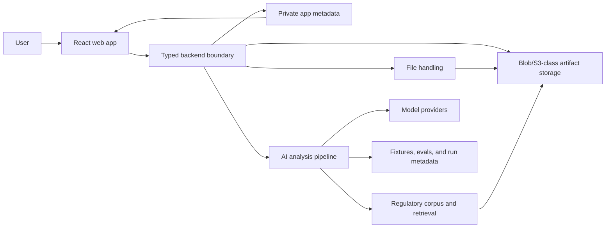

# greenlit.ai v1 MVP Architecture

This document describes the desired product outcomes and high-level architecture for a v1 rebuild of greenlit.ai. It assumes the current app is a hackathon v0: useful for product discovery, but not prescriptive for the rebuild.

This is not an implementation spec. It should guide architecture decisions without locking in exact routes, data models, file layouts, function names, or prompt details. The companion implementation checklist lives in `docs/v1-rebuild-implementation-plan.md`.

## Product Direction

greenlit.ai helps regulatory teams improve draft FDA GRAS notices before submission. A user uploads a draft filing and receives a structured, reviewable gap analysis that helps them understand readiness, missing evidence, relevant comparables, and follow-up work.

The v1 MVP should feel like a complete product for this core workflow:

1. Submit a draft filing.
2. See analysis progress.
3. Review a clear readiness summary.
4. Drill into the most important gaps and evidence.
5. Save the analysis.
6. Return later and track follow-up notes.

The v1 product contract includes the current differentiated surfaces: comparable filings, safety signals, documentation benchmarking, filing diff, research lookup, amendment outline generation, export, saved analyses, history, and workbook notes. The MVP should keep these surfaces focused and reliable rather than broad or exhaustive.

## Must-Have Product Outcomes

### Filing Submission

- A user can upload a draft GRAS notice PDF.
- A user can use a demo result without signing in.
- The app communicates progress and failure states clearly.
- Failed uploads or analyses leave the user with a recoverable next step.

### Useful Analysis

- The report gives a concise readiness signal, not just a wall of generated text.
- The report identifies the most important gaps first.
- Each major finding explains why it matters and what action is recommended.
- Comparable filings, safety signals, documentation coverage, research, and diff-style context are part of the report experience.
- The report separates AI-generated judgment from retrieved evidence, deterministic metadata, and user notes.
- The report is grounded enough that a regulatory reviewer can decide whether the finding is useful.

### Saved Work

- A signed-in user can save an analysis.
- A signed-in user can return to saved analyses later.
- A signed-in user can add workbook notes or status labels for follow-up.
- Saved work is private to the right user or workspace.

### Trust And Safety

- Private uploaded filings are not exposed to other users.
- Secrets and model-provider calls never live in the browser.
- Upload, status, result, saved report, notes, and outline access are bound to an authenticated user or explicit session before real user uploads.
- Uploaded-file and generated-report retention are explicit before real users rely on the product.
- The app avoids presenting AI output as legal or FDA determinations.

### Developer Confidence

- The repo has one clear local setup and package manager.
- Product logic is TypeScript-first across the frontend and backend.
- The demo flow works without live AI credentials.
- The real analysis flow can be tested against representative fixtures.
- Prompt, model, or retrieval changes can be evaluated before shipping.

## MVP User Stories

### Filing Owner

- As a filing owner, I can upload a draft notice so I can understand whether it is ready for review.
- As a filing owner, I can see progress so I know the system is working.
- As a filing owner, I can review the top gaps and recommended next steps so I know what to fix first.
- As a filing owner, I can save an analysis and return later so I do not lose work.
- As a filing owner, I can add notes so I can track remediation progress.

### Regulatory Reviewer

- As a reviewer, I can inspect the reasoning and evidence behind each major finding.
- As a reviewer, I can tell which parts are AI conclusions, retrieved references, deterministic metadata, or human notes.
- As a reviewer, I can see caveats where human judgment is required.

### Developer Or Operator

- As a developer, I can run and test the app locally without guessing which setup path is current.
- As an operator, I can understand why a report changed after a prompt, model, retrieval, or corpus update.

## Architecture Shape

The v1 MVP should have a narrow browser client, a typed backend boundary, a staged AI pipeline, and a small set of supporting data surfaces.

## Component Responsibilities

| Component | Primary Responsibility | Should Avoid |
| --- | --- | --- |
| React web app | User workflow, upload UI, report display, workbook interactions, local UI state | Secret-bearing calls, direct model-provider calls, persistence rules |
| Backend boundary | Authorization, persistence, file orchestration, analysis state, AI calls, report generation | Becoming a grab bag of unrelated scripts |
| Private app metadata | Ownership, status, summary fields, storage keys, checksums, and small queryable records | Large PDFs, extracted text, generated documents, full corpus artifacts, or oversized report blobs |
| Artifact storage | Uploaded PDFs, extracted text, generated outlines/exports, large reports, and corpus artifacts that may be many megabytes or larger | Access without backend authorization checks, or app code that assumes whole artifacts fit comfortably in memory |
| File handling | Accept uploads, validate files, extract enough content for MVP analysis | Hiding retention behavior or leaking private filings into public data |
| AI analysis pipeline | Turn extracted filing content and retrieved context into reviewable findings | One-off prompt calls with no structure, versioning, or eval path |
| Regulatory corpus and retrieval | Provide relevant comparables and supporting evidence | Mixing public corpus data with private user uploads |
| Saved work and workbook | Store user-scoped analyses, history, notes, and status | Over-designing team workflows before MVP needs them |
| Fixtures and evals | Protect the demo flow and AI behavior from regressions | Replacing human review of report usefulness |
| Deployment runtime | Host the app, keep environments paired, protect secrets | Splitting product logic across unnecessary backends |

## Technology Direction

Use these as architectural choices, not as a detailed implementation recipe:

- `pnpm` for the workspace and dependency workflow.
- React and TypeScript for the web app.
- Server-side TypeScript for product backend logic.
- Convex as the preferred backend for app state, file references, actions, and saved work.
- Vercel for web hosting and previews.
- Vitest for fast TypeScript tests.
- AI SDK-style patterns for provider abstraction, structured outputs, and testable AI calls.
- Blob/S3-class storage for large private or generated artifacts, with Convex storing metadata and access-controlled references.

If PDF extraction, OCR, or corpus processing does not fit Convex cleanly, introduce a narrow TypeScript worker. That worker should be an implementation detail behind the backend boundary, not a second product backend.

The blob/S3-class storage choice is intentional because uploaded filings, extracted text, generated exports, and corpus artifacts may be many megabytes and could eventually reach gigabyte scale. The backend should use storage references, checksums, and streaming or chunked processing rather than assuming full artifacts fit inside Convex documents, serverless memory, or model context.

The Convex/serverless path is plausible for MVP if processing is chunked and reference-based. The backend should avoid loading large PDFs, full extracted filings, or the full corpus into memory when a storage reference, selected text slice, or retrieved chunk set is enough.

AI provider calls should receive only the uploaded filing text needed for the step and the selected retrieved chunks. Corpus data should be addressed through vector and storage references, not copied wholesale into request context or server memory.

## AI Architecture Direction

AI should be treated as a testable product subsystem.

The MVP pipeline should be staged at a high level:

1. Ingest the uploaded filing.
2. Extract enough filing content for analysis.
3. Retrieve relevant comparables or references.
4. Generate prioritized findings and recommended actions.
5. Normalize the result into the report shape used by the UI.
6. Save enough run context to debug and evaluate changes.

The exact prompts, schemas, retrieval strategy, scoring, and provider choices should evolve during implementation. The architectural requirement is that changes are observable and evaluatable, not that every detail is fixed upfront.

## Existing Subsystem Compatibility

The rewrite should not assume the current Python/FastAPI analysis engine is wrong, but every subsystem should be intentionally ported, wrapped, replaced, deferred, or deleted. Before removing the v0 path, classify each of these:

- [ ] PDF upload and validation.
- [ ] PDF text extraction and OCR fallback.
- [ ] Prompt construction and structured AI output parsing.
- [ ] Anthropic/OpenAI provider calls.
- [ ] Pinecone/vector retrieval or replacement.
- [ ] Public GRAS corpus sidecars and chunk metadata.
- [ ] Comparable filings generation.
- [ ] Documentation-field benchmark generation.
- [ ] Scoring and health-score logic.
- [ ] Report contract normalization.
- [ ] PubMed research lookup.
- [ ] Amendment outline `.docx` generation.
- [ ] Print/PDF export.
- [ ] Result retention and deletion.
- [ ] Run metadata for evals and debugging.

For preserved subsystems, define a product-level acceptance check. For deferred or deleted subsystems, record why that choice does not break the MVP promise.

## Data Direction

Do not finalize the data model in this document.

At a high level, v1 needs to keep these concerns separate:

- Private user work: uploaded filings, saved analyses, workbook notes, and history.
- Public or curated corpus material: regulatory notices, references, and retrieval inputs.
- AI run context: enough metadata to understand prompt, model, retrieval, and output changes.
- Test and eval fixtures: representative examples that protect the MVP workflow.

Large artifacts should not be stored directly inside Convex documents. Uploaded PDFs, extracted filing text, generated `.docx` files, large result JSON/report payloads, and corpus artifacts should live in blob/S3-class storage because they may be many megabytes or larger. Convex should store ownership, status, storage keys, checksums, timestamps, and small summary fields needed by the UI and backend.

The MVP can start with the smallest persistence shape that supports save, reload, notes, upload state, and report display. Add more structure only when the product needs it.

## Quality Direction

The v1 MVP should be considered architecturally healthy when:

- The demo flow works without live AI credentials.
- The real upload flow works with configured credentials.
- Saved work survives refresh and is user-scoped.
- AI output failures produce usable fallback states.
- A representative fixture can be rerun before prompt or model changes.
- Typecheck, tests, and build are part of the normal workflow.
- The team can tell which app version, prompt/model setup, and corpus inputs produced a report.

## Out Of Scope For MVP

- Full team workspace administration.
- Advanced warehouse or analytics platform.
- Complex operator dashboards.
- Multiple provider comparison UI.
- Large production data migration unless existing users require it.
- Fully automated corpus operations beyond what the MVP needs.
- Exhaustive report sections that are not reliable or useful yet.

## Open Decisions

Make these decisions when the MVP work reaches them:

- Exact report contract.
- Exact persistence shape.
- Auth provider and workspace model.
- Uploaded-file retention.
- Generated-report retention.
- PDF extraction approach.
- Corpus scale and refresh process.
- Whether any TypeScript worker is needed outside Convex.
- Eval acceptance criteria for prompt, model, and retrieval changes.
